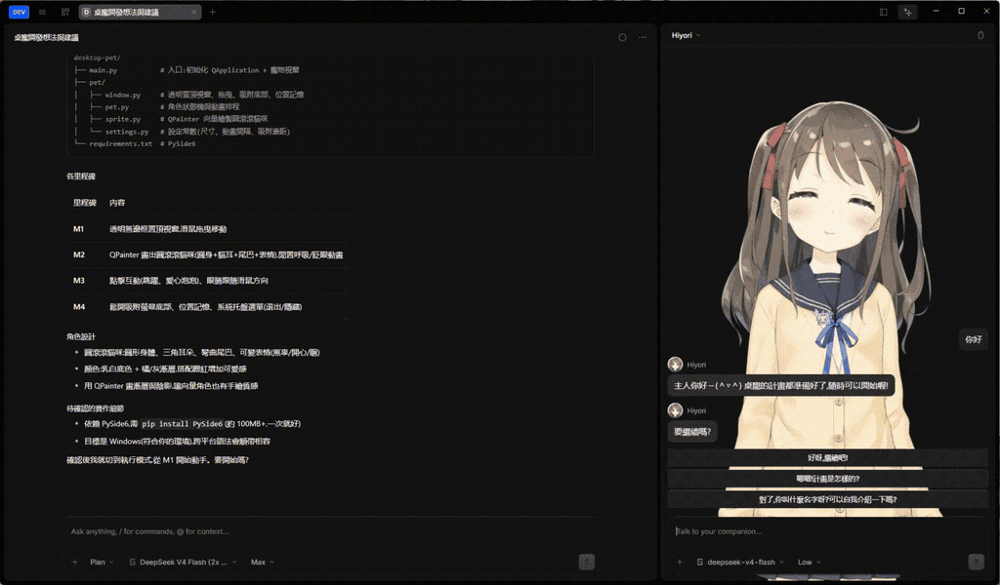
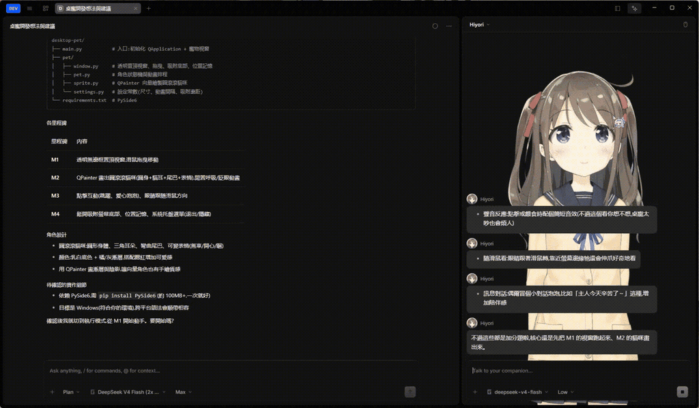

# OpenCode Wife

[English](./README.md) · [繁體中文](./README.zh-TW.md) · [文档](./docs/README.md)

为 [OpenCode Desktop](https://github.com/anomalyco/opencode) 打造的 Live2D 陪伴角色 — 一个基于 fork 的呈现层,让开发工作有角色陪伴对话,同时不干扰工作本身。

> **Alpha 版本** — 仅限 Windows x64。安装包未签名;见[安装](#安装)。Side Chat 现已稳定可用;Live2D 渲染为可选功能,需要自行安装运行环境(不会附带任何专有文件)。

## 功能

- **Side Chat** — 主 Agent session 旁的第二个只读对话界面。可以一边让 Agent 工作一边问项目问题;Wife session 只能使用 `read` / `glob` / `grep` 工具,永远不能写文件或执行命令。
- **Live2D 角色** — 挂载自己的模型(`.model3.json` 文件夹),用可视化编辑器绑定动作与表情,在侧边面板观看角色反应。
- **易读的对话气泡** — 可调整高度、文字大小、显示节奏、对比度与动画;每个气泡都可显示角色名称。
- **`/send`** — 把 Side Chat 变成可编辑的 Agent 草稿(Replace / Append / Cancel;绝不自动提交)。
- **`/clear`** — 永久删除当前 Wife 对话,同时保留角色、persona、模型与视图偏好。
- **Persona** — 每个角色的名称、称呼方式与受长度限制的说话指令,从下一次回复开始生效。
- **回复选项** — 每次回答后,由独立低成本模型生成 2–3 个简短后续建议,以按钮呈现。

## 画面示例

| 回复选项 | 发送给 Agent |
|---|---|
|  |  |

## 与 OpenCode 的关系

OpenCode Wife 是**衍生作品**,不是取代 OpenCode 的 fork。两者可并行安装,共用同一份 Agent 数据 — 但**同一时间只能运行其中一个**:

- sessions、projects、provider credentials 与 Agent 历史持续共用。
- Wife 专属数据(角色、persona、Live2D 路径、Side Chat 设置、窗口状态)只存在 Wife profile。
- 其中一个 App 运行时,启动另一个只会聚焦已运行的 App,不会启动第二个 backend — 绝不允许两个 backend 同时写入同一个数据库。
- 在任一个 App 关闭的 session,另一个 App 立即可见,无需重新导入。

Side Chat 不会污染你的主 Agent transcript。它是独立的 archived session,带 deny-all/只读权限配置,因此它的回复与工具不会进入 Agent 的 context。

## 安装

1. 从 [Releases](https://github.com/RyuuMeow/opencode-wife/releases) 下载 Windows x64 安装包(`opencode-wife-0.1.0-alpha.1-win-x64.exe`),并验证 SHA-256 checksum。
2. 首个版本未签名:Windows SmartScreen 会显示警告。选择**更多信息** → **仍要运行**。
3. 首次启动时,Wife 会询问是否从既有 OpenCode profile 导入安全的 UI 偏好(之后随时可在 **Settings → Wife → OpenCode data** 重新导入)。

## 开始使用

### 1. 和角色聊天

打开 session,按 `mod+alt+w`(或标题栏的 **Toggle Wife** 按钮)打开面板,发送消息。角色会读取当前 Agent 的 context,用只读工具回答。

面板操作:

- **左上角角色下拉菜单** — 切换此 session 显示的角色。
- **右上角鼠标图标** — 进入 Live2D 模型操作模式:拖拽移动模型、滚轮缩放(0.2x–3x)。此模式下聊天 UI 暂停;按 `Escape` 或再次点击图标回到聊天。
- **对话区域滚动鼠标滚轮** — 向上滚动展开详细对话历史,向下滚动收起回近期消息。

### 2. 设置模型与 provider

- **主聊天模型**:Wife session 共用你配置的 OpenCode provider/model。
- **选项生成器**:**Settings → Wife → Reply choices** — 独立低成本模型(默认 `opencode/deepseek-v4-flash` at `low`)建议后续回复,不延迟主回答。
- **Persona**:**Settings → Wife → General** — 称呼方式与说话指令。

### 3. 安装 Live2D 运行环境

OpenCode Wife **不附带** `live2dcubismcore.min.js` 或任何示例模型。

1. **Settings → Wife → Live2D runtime** → **下载并安装**。
2. Wife 会从官方 Live2D CDN 下载兼容 Core 并验证(记录版本与 SHA-256);下载即表示接受 [Live2D 许可条款](https://www.live2d.com/en/sdk/license/)。
3. **选择文件…** 可接受较早 SDK 的 ZIP 或 `live2dcubismcore.min.js`。
4. 随时可在同一界面替换或移除运行环境。

**Core 兼容性**:内置运行时需要具备旧版 `csmGetDrawableRenderOrders` API 的 Cubism Core。最新的 Cubism 5 SDK 改用了新名称,安装时会被拒绝并显示清晰提示 — 请改用官方 CDN 文件(`https://cubism.live2d.com/sdk-web/cubismcore/live2dcubismcore.min.js`)或较早的 SDK 版本。

渲染需要 Live2D 模型:**Settings → Wife → Characters** 添加角色并选择模型文件夹。官方免费的 [Hiyori 示例](https://www.live2d.com/en/learn/sample/momose-hiyori/) 是不错的起点 — 使用前请确认其条款。导入模型的方式见[文档](./docs/README.md)。

没有这些东西 Side Chat 也完全正常 — 面板只会显示 setup 状态。

### 4. 命令

- `/send` — 把 Side Chat 总结成可编辑的 Agent 草稿。
- `/clear` — 删除当前 Wife 对话。

## 共用数据、更新与兼容性

- **共用 Agent state**:sessions、projects 与 credentials 从与 OpenCode 相同的数据根目录读取。两边的升级都要注意:升级 OpenCode 后,Wife 可能需要同步升级,反之亦然。
- **兼容性守卫**:启动前 Wife 会检查共用数据库的 schema。若 OpenCode 已升级到 Wife 无法读取的 schema,Wife 会拒绝启动并显示可操作的提示 — 绝不降级或修改数据库。
- **更新**:Wife 的自动更新在 alpha 停用。请手动查看 [Releases](https://github.com/RyuuMeow/opencode-wife/releases) 页面。附带的 Agent backend 永远不会自行更新。
- **备份**:任何会修改 schema 的启动前,会先保留共用数据库的一致性备份(保留最近三份)。

## 隐私与安全

- Wife session **结构上只读**:只能使用 `read` / `glob` / `grep`,没有写入或执行工具,没有权限弹窗。这是服务器端权限配置强制的,不是隐藏按钮。
- 你的代码、prompt 与对话会发送到你配置的 LLM provider — 与 OpenCode 相同的数据流。
- Live2D 模型文件与 Cubism Core 只留在本机,不会上传。
- Alpha 注意事项:无自动更新、安装包未签名、仅 Windows x64。问题反馈请到 [issue tracker](https://github.com/RyuuMeow/opencode-wife/issues);安全问题请用 [Private Vulnerability Reporting](https://github.com/RyuuMeow/opencode-wife/security/advisories/new)。

## 从源码构建

```sh
bun install
bun run build          # packages/app
bunx electron-vite build  # packages/desktop
bun run package:win    # packages/desktop — Windows x64 NSIS installer
```

本地构建注意事项见 [docs/README.md](./docs/README.md),环境细节见 [docs/12-handoff.md](./docs/12-handoff.md)。

## 许可与声明

MIT — 见 [LICENSE](./LICENSE)。OpenCode Wife 是 [OpenCode](https://github.com/anomalyco/opencode) 的独立衍生作品;归属与 Live2D 商标/许可说明见 [NOTICE.md](./NOTICE.md)。

Live2D 与 Cubism 是 Live2D Inc. 的商标。本项目与 Live2D Inc. 无关,亦未获其背书。散布本软件不代表 Live2D 已核准其许可分类 — 请自行查看 [Live2D SDK 许可](https://www.live2d.com/en/sdk/license/)。
