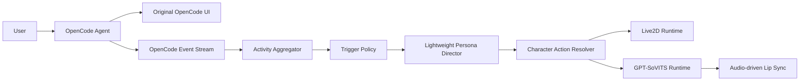

# One-pager

## Problem

OpenCode exposes detailed technical progress that is useful to developers but unsuitable for a conversational Live2D character. Directly mirroring tool calls, token streaming and logs would make the character noisy, repetitive and unnatural.

At the same time, rewriting OpenCode's agent pipeline would increase maintenance cost and make upstream updates difficult.

## Proposed solution

Build a low-impact presentation pipeline beside OpenCode:



OpenCode's technical response remains the source of truth. The Wife pipeline only creates a short spoken representation and visual performance.

## Product model

- Characters are registered globally.
- A project references a registered character and may override speech/persona policy.
- A session only holds transient activity and presentation state.
- The active tab determines the visible character by default.
- Background sessions do not normally speak.

## Core semantic model

The persona model selects semantic concepts, not Live2D asset names:

```text
State:   idle / listening / thinking / working / waiting_user / speaking
Gesture: nod / wave / look_at_user / celebrate / custom.*
Emotion: neutral / focused / happy / concerned / confused
```

A character profile maps these concepts to its own motions, expressions and parameters.

## Why this structure

- OpenCode behavior remains intact.
- Different Live2D models can use different motion names.
- Voice engines can be replaced without changing character logic.
- Projects can use different characters without duplicating assets.
- Persona or TTS failures degrade to silence or templates instead of blocking work.

## MVP

The first useful release should support:

- global character registration
- one Live2D model per character
- one GPT-SoVITS voice preset per character
- project-to-character assignment
- idle, working, waiting, success and error behavior
- completion, permission and error speech
- volume-based mouth movement
- Classic Mode that bypasses the Wife layer

Split panes and tab detachment are valuable desktop extensions, but they should follow the stable character pipeline rather than block the MVP.

## Success criteria

The product succeeds when:

1. OpenCode works normally with the Wife layer disabled.
2. A user can register a character without editing JSON manually.
3. Switching projects switches character configuration predictably.
4. The character does not narrate routine tool activity.
5. Permission, question, completion and failure events are communicated promptly.
6. Speech and mouth movement remain synchronized.
7. Persona, TTS or Live2D failures do not interrupt the coding session.
