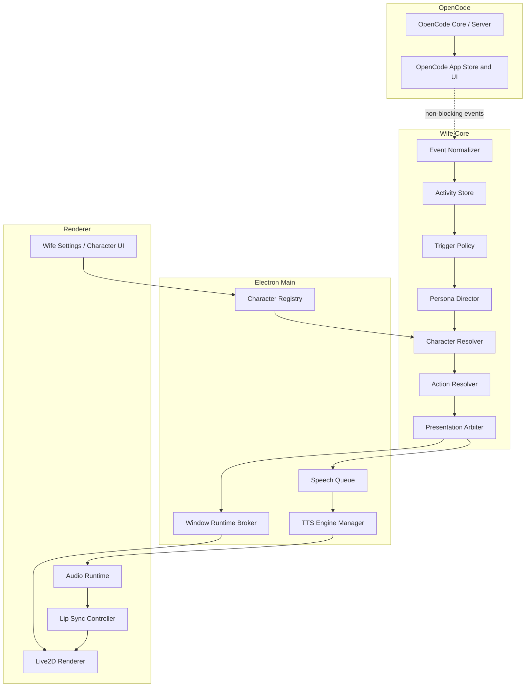

# System Architecture

## Architectural goal

Add a product layer without inserting new blocking dependencies into OpenCode's agent, tool or permission execution path.

## Top-level components



## Component responsibilities

### Event Normalizer

Adapts version-specific OpenCode events into a stable Wife event contract. No AI calls.

### Activity Store

Maintains semantic snapshots by session:

- current task
- phase
- status
- recent meaningful actions
- changed files
- permission/question state
- completion/error summary

### Trigger Policy

Determines whether an event requires presentation or a persona request. Enforces cooldowns, deduplication and background-session policy.

### Persona Director

A lightweight structured-output model request that decides:

- whether to speak
- concise spoken text
- emotion
- gesture
- priority and interruptibility

It does not control model files or tool execution.

### Character Resolver

Combines configuration layers:

```text
session temporary override
→ window override
→ project binding
→ global default
→ disabled
```

### Action Resolver

Maps semantic state/gesture/emotion to a character's available Live2D assets and fallback behaviors.

### Presentation Arbiter

Coordinates competing sessions and windows. It decides what can be shown or spoken now.

### Character Registry

Owns globally registered characters, asset references, validation results and capability caches.

### TTS Engine Manager

Starts or connects to GPT-SoVITS, checks health, loads voice models and isolates engine failures.

### Speech Queue

Owns priority, interruption, cancellation and playback order.

### Window Runtime Broker

Maintains one logical character runtime per window and one speech owner where required. It prevents duplicate speech across BrowserWindows.

### Live2D Renderer

Loads the active model and applies:

- base state motion
- one-shot gesture
- expression
- procedural gaze, blink and breathing
- audio-driven lip sync

## Ownership rules

- OpenCode owns technical truth.
- Wife Core owns semantic activity and presentation intent.
- Character Registry owns registered asset metadata.
- Electron Main owns external processes and cross-window coordination.
- Renderer owns WebGL rendering and actual audio playback.
- Lip sync is derived at the playback endpoint, not in the TTS process.

## Integration strategy

Prefer small hooks in upstream files:

```ts
wifeBridge.observe(event)
```

```tsx
<WifeProvider>
  <ExistingOpenCodeApp />
</WifeProvider>
```

```tsx
<WifeWorkspaceSlot />
```

Do not place substantial persona, TTS or Live2D logic in upstream session reducers, provider code or tool implementations.

## Failure isolation

Every Wife operation must be non-blocking relative to OpenCode:

```ts
void wifePipeline.observe(event).catch((error) => {
  wifeLogger.error("observe failed", error)
})
```

Fallback hierarchy:

```text
Persona unavailable  → deterministic template
TTS unavailable      → speech bubble only
Motion missing       → expression/procedural fallback
Character invalid    → default character or Classic Mode
Wife runtime failure → OpenCode continues normally
```
