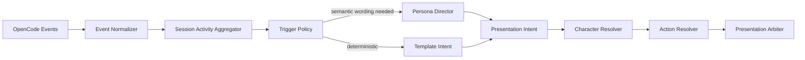

# Event and Persona Pipeline

> Status: **Paused** — Milestone 4/5; Side Chat is the current mainline


## Objective

Extract conversationally useful information without exposing internal reasoning or narrating low-level work.

## Pipeline



## Normalized events

```ts
type ActivityEvent =
  | { type: "task_started"; projectKey: string; sessionId: string; task?: string; at: number }
  | { type: "phase_changed"; projectKey: string; sessionId: string; phase: ActivityPhase; at: number }
  | { type: "meaningful_action"; projectKey: string; sessionId: string; summary: string; at: number }
  | { type: "user_action_required"; projectKey: string; sessionId: string; reason: "permission" | "question"; summary: string; at: number }
  | { type: "task_completed"; projectKey: string; sessionId: string; summary?: string; at: number }
  | { type: "task_failed"; projectKey: string; sessionId: string; summary: string; at: number }
```

The normalizer may use tool names and event properties to infer phases, but it must not expose chain-of-thought or hidden model reasoning.

## Aggregation

The aggregator should:

- deduplicate repeated reads/searches
- retain only a bounded set of recent meaningful actions
- track changed files without narrating every edit
- calculate task duration
- track current permission/question
- record the last completion/error summary
- avoid storing unbounded raw shell output

Suggested limits:

```text
recent actions: 8
changed files: 20 before summarization
recent spoken lines: 10
activity retention after completion: 30 minutes
```

## Trigger policy

### Deterministic triggers

These do not require an AI decision about whether to speak:

- permission required
- explicit question required
- task completed when enabled
- task failed when enabled

A model may still rewrite the wording, but a safe template must be ready immediately.

### Semantic triggers

Potential persona calls:

- major phase transition
- task exceeds a configurable duration
- meaningful progress after cooldown
- important discovery requiring a concise update

### Suppressed triggers

- message token delta
- repeated status event with no semantic change
- routine tool execution
- background progress when speech is disabled
- an update equivalent to a recent spoken line

## Lightweight persona request

The persona request should be compact and structured. It receives a summary, not the raw full session.

Example input:

```json
{
  "trigger": "meaningful_progress",
  "project": {
    "name": "CodePex",
    "userAddress": "主人"
  },
  "activity": {
    "status": "working",
    "phase": "verifying",
    "task": "修正登入狀態失效",
    "recentActions": [
      "已更新 session refresh 邏輯",
      "正在執行型別檢查"
    ]
  },
  "recentSpeech": [
    "我先確認登入狀態的更新流程。"
  ],
  "allowedGestures": ["none", "nod", "thinking"],
  "allowedEmotions": ["neutral", "focused", "happy"],
  "policy": {
    "maximumCharacters": 42,
    "allowTechnicalTerms": false
  }
}
```

Expected output:

```json
{
  "speak": true,
  "text": "主要修改完成了，我正在做最後確認。",
  "state": "working",
  "gesture": "nod",
  "emotion": "focused",
  "priority": "progress",
  "interruptible": true
}
```

## Output validation

Before presentation:

- validate schema
- reject unknown gestures/emotions
- cap text length
- remove blank or duplicate output
- prevent claims unsupported by the activity snapshot
- apply project speech policy
- replace missing data with a deterministic fallback

## Template fallback examples

```text
permission: 這個操作需要你的允許，要繼續嗎？
question:   我需要你確認一個選項。
completed:  這個任務完成了。
failed:     剛才遇到問題，我先停下來了。
```

## Non-blocking behavior

The pipeline does not delay OpenCode:

```ts
function onOpenCodeEvent(event: OpenCodeEvent) {
  openCodeStore.apply(event)
  wifePipeline.enqueue(event)
}
```

Persona requests must support timeout, cancellation and stale-result rejection. A result for an inactive or superseded state may be discarded.
