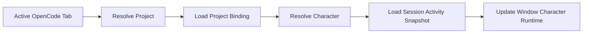

# Project and Session Routing

> Status: **Paused** — Milestone 3; the Side Chat panel keeps a single character per window for now


## Why project-level assignment

A character represents the working context rather than an individual message. Project assignment gives predictable behavior across multiple sessions while avoiding duplicated character assets.

## Project identity

Prefer a stable OpenCode project ID. When unavailable, use a canonical composite key:

```ts
type ProjectIdentity = {
  serverId: string
  projectId?: string
  canonicalWorktree: string
}
```

Never identify a project by folder name alone.

## Resolution hierarchy

```text
session temporary override
→ window character lock
→ project binding
→ global default character
→ Wife Mode disabled
```

A temporary selection should offer two actions:

- use for this session
- make default for this project

## Active tab routing



Character changes should be asynchronous and cancellable. Rapid tab switching must not complete stale model loads.

## Same-character optimization

When two projects use the same character:

- keep the Live2D model loaded
- change project/persona context only
- update current activity state
- avoid replaying an introduction

## Background session policy

Each session maintains activity independently, but presentation access is mediated by the arbiter.

Default eligibility:

| Background event | Visual takeover | Speech | Notification |
|---|---:|---:|---:|
| routine progress | no | no | no |
| meaningful progress | no | no | optional |
| completion | no | no | yes |
| question | optional prompt | optional | yes |
| permission | prompt | yes when enabled | yes |
| critical failure | optional | optional interrupt | yes |

## Presentation priority

```ts
type PresentationPriority =
  | "ambient"
  | "progress"
  | "completion"
  | "question"
  | "permission"
  | "critical"
```

Order:

```text
critical > permission > question > completion > progress > ambient
```

Priority alone is insufficient. The arbiter also checks:

- active project/session
- user speech preferences
- current job interruptibility
- freshness/expiry
- whether another window owns speech

## Multi-window behavior

Recommended first implementation:

- each BrowserWindow has one active visual character runtime
- Electron Main maintains a registry of window runtimes
- one window owns a speech job
- a job is routed to the window that originated the active project context
- duplicate speech is never broadcast to all windows

Later, a detached character window may become the visual/audio owner while following another OpenCode window's active context.

## Detached tabs and workspace extensions

Project-character routing should not depend on split-pane implementation. A tab carries enough identity to resolve its project regardless of pane or window.

```ts
type WorkspaceTabContext = {
  tabKey: string
  windowId: string
  paneId?: string
  projectKey?: string
  sessionId?: string
}
```

This allows future:

- split panes
- tab moves between panes
- detached windows
- dedicated Live2D utility tab

without redesigning character configuration.
